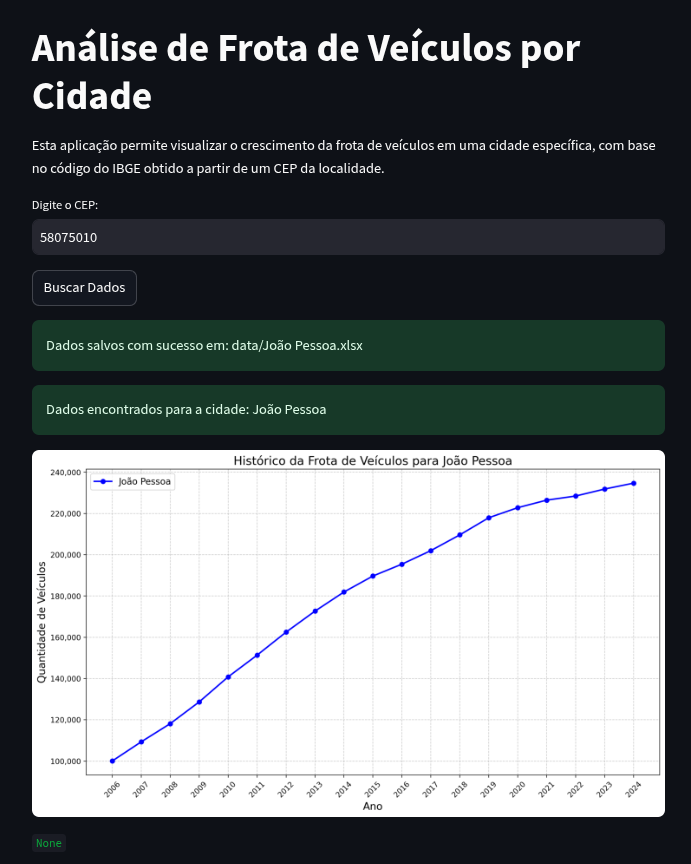
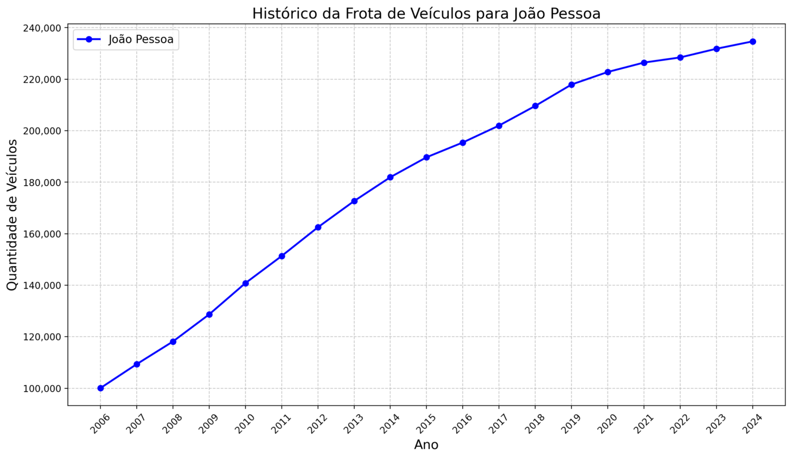

# API correspondente à nota final da disciplina Programação de Computadores - Centro Universitário de João Pessoa (Unipê)

<p align="justify">
Esta aplicação permite visualizar o crescimento da frota de veículos em uma cidade específica, com base no código do IBGE obtido a partir de um CEP da localidade. 
Ela faz isso obtendo dados da API [ViaCep](https://viacep.com.br/), passando um CEP como argumento. Em seguida, os dados são separados, pois apenas o código do IBGE da cidade e seu nome nos interessam. 
Com esses parâmetros, fazemos uma requisição à API do [IBGE](https://servicodados.ibge.gov.br/api/docs/pesquisas). Com os dados obtidos, criamos um [DataFrame](https://pandas.pydata.org/pandas-docs/stable/reference/api/pandas.DataFrame.html) para ser consumido pela biblioteca [Matplotlib](https://matplotlib.org/stable/index.html) e gerar um gráfico que permite observar o crescimento ou decaimento da frota de veículos da cidade analisada. Para o FrontEnd foi utilizado a library [Streamlit](https://docs.streamlit.io/) uma vez que ela abstrai o uso de liguagens de marcação como HTML e CSS.
</p>

## Estrutura do projeto

```bash
/projeto
│-- /api
│   │-- library.py
│   │-- main.py
│-- /data
│   │-- {cidade}.xlsx
│-- /logs
│   │-- app.logs
│-- /image
│   │-- /README
│-- requirements.txt
│-- .gitignore
```

## Procedimentos Para Execução do Projeto

### Clone o Projeto

```bash
git clone https://github.com/marciodelfinooliveira/ProceduralPythonProject.git
```

### Entre na pasta

```bash
cd ProceduralPythonProject/
```

### Crie um Virtual Environment

```bash
python3 -m venv venv  # Para sistemas UNIX
```

### Ative a Virtual Environment

```bash
source venv/bin/activate  # Para sistemas UNIX
```

### Instale as bibliotecas necessárias

```bash
pip install -r requirements.txt
```

### Execute o sistema via Streamlit

```bash
streamlit run ./api/main.py
```

### Programa em Execução - Porta padrão (http://localhost:8501/)



### Exemplos de Entradas

```
João Pessoa - 58046-731
Patos - 58700-015
Pombal - 58840-970
Recife - 52080-066
Manaus - 69033-008
São Paulo - 04962-30
```

Exemplos de Saida


